# Arquitectura y Planos de Restorify

Guía para quien llega nuevo al código y necesita entender cómo está armado el sistema antes de tocarlo. Esto combina la arquitectura general y los "planos" visuales de cómo se conectan las piezas. Para *qué* hace y *por qué* (reglas de dinero, roles, avisos), el complemento es [reglas-de-negocio.md](reglas-de-negocio.md). Para el detalle de archivos por sección, [mapa-de-secciones.md](mapa-de-secciones.md).

---

## Índice

1. [Lo esencial en un minuto](#1-lo-esencial-en-un-minuto)
2. [Las capas de la casa y la decisión principal](#2-las-capas-de-la-casa-y-la-decisión-principal)
3. [Mapa del repositorio y de pantallas](#3-mapa-del-repositorio-y-de-pantallas)
4. [Modelo de datos y tablas](#4-modelo-de-datos-y-tablas)
5. [El ciclo de vida de una orden](#5-el-ciclo-de-vida-de-una-orden)
6. [Dónde vive la lógica de negocio y cómo viaja un dato](#6-dónde-vive-la-lógica-de-negocio-y-cómo-viaja-un-dato)
7. [El camino del dinero y comisiones](#7-el-camino-del-dinero-y-comisiones)
8. [Seguridad, permisos y roles](#8-seguridad-permisos-y-roles)
9. [Servidor: edge functions, portal y correos](#9-servidor-edge-functions-portal-y-correos)
10. [El frontend por dentro](#10-el-frontend-por-dentro)
11. [Migraciones, flujo de trabajo y cómo sale un cambio](#11-migraciones-flujo-de-trabajo-y-cómo-sale-un-cambio)
12. [Levantar el proyecto](#12-levantar-el-proyecto)
13. [Solución de problemas y trampas conocidas](#13-solución-de-problemas-y-trampas-conocidas)

---

## 1. Lo esencial en un minuto

| | |
|---|---|
| **Frontend** | React 19 + TypeScript 6, construido con Vite 8 |
| **Datos remotos** | TanStack Query (caché, reintentos, invalidación) |
| **Backend** | Supabase: PostgreSQL 17, Auth, Storage, Realtime, Edge Functions (Deno 2). Proyecto `dbstores` en `ca-central-1`; inventario en [supabase.md](supabase.md) |
| **Tareas en la base** | pg_net (llamadas HTTP asíncronas) y pg_cron (tareas programadas) |
| **Ruteo** | react-router-dom 7, todo del lado del cliente |
| **Formularios** | React Hook Form + Zod (mini) |
| **Estilos** | CSS plano con variables, sin framework de UI |
| **Multimedia** | MediaRecorder, WebCodecs vía Mediabunny, subidas reanudables TUS |
| **Push** | Web Push (VAPID) con service worker; app instalable (PWA) |
| **Correo** | Resend (dominio `restorifyauto.net` verificado): avisos automáticos al cliente |
| **Portal del cliente** | Paquete aparte en `/r/<token>`, sin cuenta; datos por una edge function pública |
| **Presupuestos** | Estado por línea (borrador → pendiente → aprobado/rechazado); solo lo aprobado se cobra |
| **Pruebas** | Vitest (unitarias y componentes), pgTAP (base de datos), Playwright (e2e) |
| **Hosting** | Sitio estático en Hostinger, dominio `restorifyauto.net`; Hostinger compila y publica desde GitHub en cada push. El diseño es la rama `produccion`; hoy publica `main` ([evaluacion-2026-10.md](historico/evaluacion-2026-10.md#5-operación-y-despliegue)) |

Unas 33 600 líneas de TypeScript (con pruebas), 5 600 de CSS, 54 migraciones y 26 tablas (1/10/2026).
Cómo se llegó hasta aquí, etapa por etapa: [evolucion.md](evolucion.md). Estado de la estructura y deuda técnica: [mantenimiento.md](mantenimiento.md).

---

## 2. Las capas de la casa y la decisión principal

La idea que explica todo lo demás: **no hay servidor propio.** El navegador habla directamente con Supabase a través de PostgREST. No existe una capa de API intermedia (Node, Python) donde poner validaciones, permisos ni reglas de negocio.

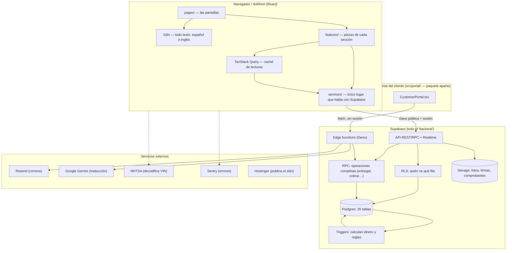

De esto se derivan tres consecuencias que hay que tener presentes **siempre**:

**1. La clave anónima y todas las tablas son públicas.** Viajan dentro del bundle de JavaScript. Cualquiera con las herramientas de desarrollo abiertas puede hacerle a la API las mismas peticiones que hace la aplicación, con su propio token de sesión legítimo.

**2. Esconder un botón en React no es una restricción, es una sugerencia visual.** Un `{isAdmin && <button/>}` mejora la experiencia; no protege nada. Lo único que sostiene un límite de verdad son las políticas RLS y los triggers de Postgres.

**3. La lógica que debe cumplirse siempre va en la base de datos.** Si una regla solo existe en el frontend, se la salta cualquiera que llame la API directamente, y también cualquier pantalla futura que olvide replicarla.

> Cuando agregues una restricción, la pregunta correcta no es «¿escondí el botón?» sino «¿qué pasa si alguien manda esta petición a mano?».

Un ejemplo concreto de este principio: los montos de una orden (totales, repuestos con precio, depósito) no están en `ordenes_trabajo` con columnas escondidas, sino en tablas que un técnico **no puede leer** (`orden_montos`, `orden_repuestos`). Esconder columnas habría dejado el dinero en la respuesta de red, a un clic de las herramientas del navegador.

---

## 3. Mapa del repositorio y de pantallas

### Mapa de carpetas

```
src/
  main.tsx                       entrada: /r/... carga portal/, lo demás appStart
  appStart.tsx                   app del taller: Sentry, service worker, <App />
  App.tsx                        proveedores + rutas + guardias de acceso

  portal/                        reporte web del cliente (paquete aparte, sin Supabase JS)
  pages/                         una pantalla por archivo
  features/                      módulos con estado propio, extraídos de las páginas
  components/                    componentes reutilizables y layout global
  context/                       estado global (Auth, Language, Theme, Toast, UnsavedChanges)
  services/                      TODAS las consultas a Supabase, un módulo por dominio
  lib/                           lógica sin React (pura, muy testeable)
  types/                         database.ts reexporta domain/*.types.ts
  i18n/translations.ts           español e inglés
  styles/                        index.css (variables, temas) + components.css
  test/                          utilidades de prueba

public/                          sw.js (service worker), iconos PWA, .htaccess
supabase/
  migrations/                    54 migraciones, en orden cronológico
  functions/                     edge functions (Deno)
  tests/database/                pruebas pgTAP
  config.toml
```

**Reglas de organización**
1. **Ninguna pantalla llama a Supabase directamente.** Todo pasa por un módulo de `services/`.
2. **`lib/` no sabe que existe React** (salvo `useMediaQuery`).
3. **Una página que crece se parte en `features/`.**

### El mapa de pantallas

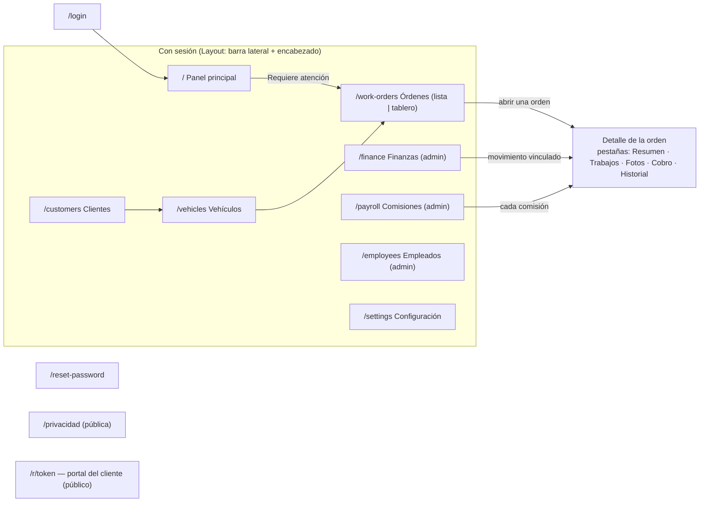

---

## 4. Modelo de datos y tablas

El eje es la **sede**: casi todo cuelga de ella y no se mezcla entre talleres. Dentro de la sede, un técnico solo ve las órdenes que tiene asignadas.

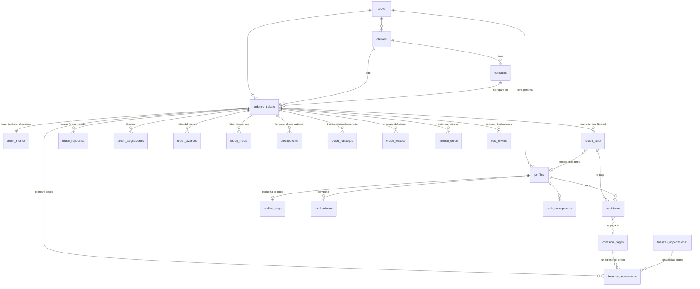

### Detalles que no son obvios

- **El dinero está repartido a propósito:** `ordenes_trabajo.total_labor` es visible para el técnico (base de su comisión), pero `orden_montos` y `orden_repuestos` son admin-only por RLS.
- **Los repuestos son de traspaso:** Se captura precio; un trigger copia el precio al costo (`costo_unitario`).
- **`vehiculos.sede_id` es redundante:** Lo llena `trg_vehiculo_sede` explícitamente para RLS.
- **La multimedia no son URLs:** `orden_media` guarda la ruta. Se ven con URLs firmadas de vida corta.
- **El enlace del cliente guarda el token tal cual:** Lo protege RLS (solo admin).
- **Cada línea (labor/repuesto) tiene estado:** Solo lo `aprobado` entra en los totales, comisiones y costos.

---

## 5. El ciclo de vida de una orden

El corazón del programa. Cada flecha dice **quién** la mueve y **qué hace la base** solita.

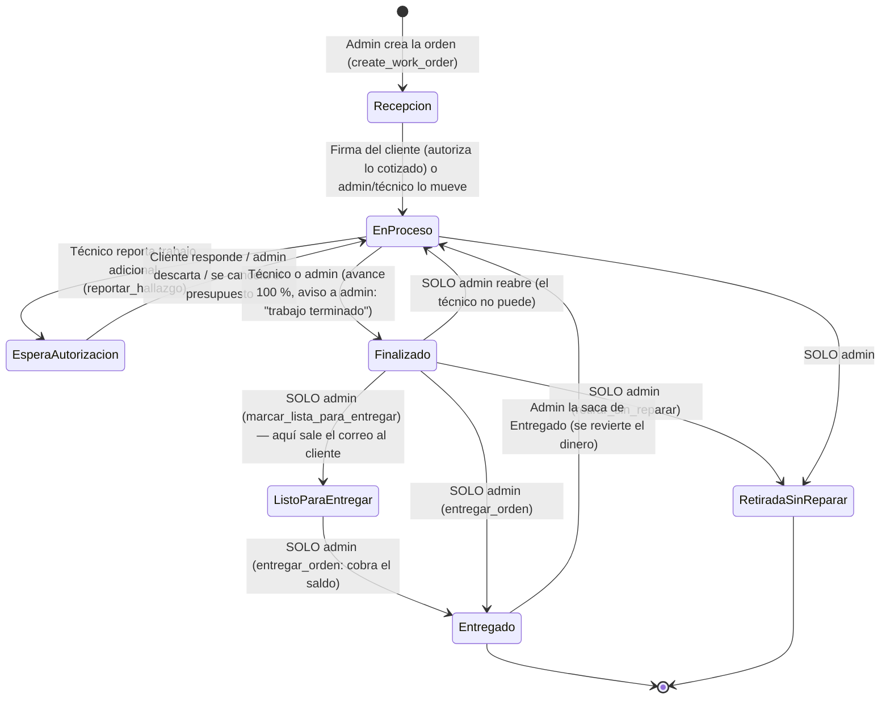

Qué dispara cada paso (todo en la base, `supabase/migrations/`):

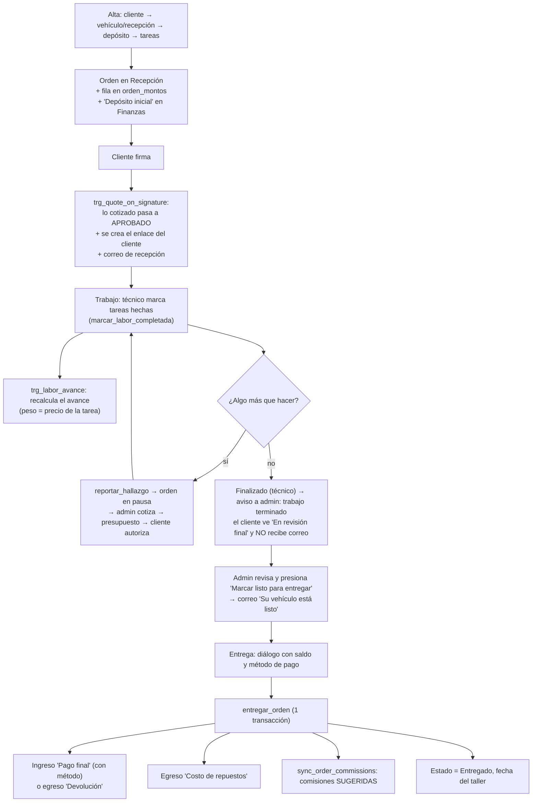

---

## 6. Dónde vive la lógica de negocio y cómo viaja un dato

**En triggers y funciones de PostgreSQL**, no en el frontend.

### Cómo viaja un dato (de pantalla a base y de vuelta)

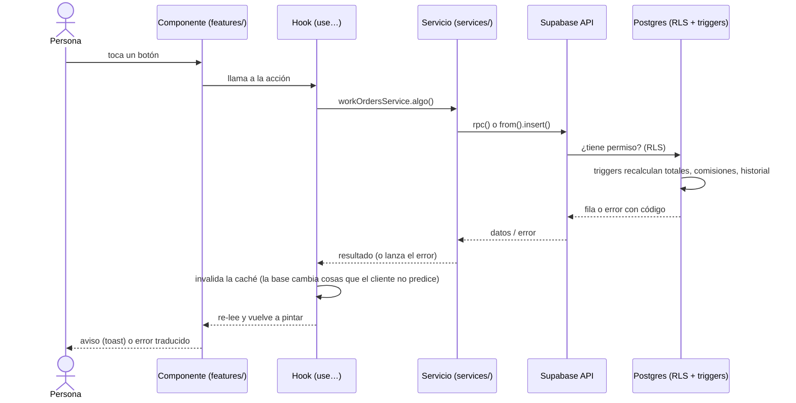

### Triggers principales (Resumen)
- **`ordenes_trabajo`**: guards para que el técnico no toque órdenes entregadas, generación atómica del número de orden, cálculo de `orden_montos`, recálculo de avance (`trg_progress_on_status`), asentar finanzas al entregar (`trg_order_delivery_payment`, `trg_order_parts_expense`), recalcular comisiones.
- **`orden_montos`**: recálculo de depósito, ajuste de totales post-entrega.
- **`orden_labor` y `orden_repuestos`**: recalculo de totales cuando cambia un precio aprobado, guards de presupuesto, cálculo de comisiones.
- **`orden_asignaciones`**: inmutabilidad del owner, re-reparto de bolsas heredadas.

Casi todos son `SECURITY DEFINER` (corren con permisos del dueño) y usan `is_admin()` o `auth.role()` para validar los guards.

### Funciones RPC que llama el frontend
- `create_work_order`, `entregar_orden`: Operaciones transaccionales grandes.
- `repuestos_de_orden`: Ve repuestos pero omite precios para técnicos.
- `comisiones_estimadas`, `resumen_empleado`, `balance_orden`, `margen_ordenes`: Vistas calculadas.
- `pay_commissions`: Asienta pagos de comisiones con total del servidor.
- `app_schema_version`: Detecta desfase entre build y base.
- `resumen_panel`: KPIs del dashboard.
- `importar_estado_cuenta`: Importación bancaria en una transacción.

---

## 7. El camino del dinero y comisiones

Lo único que **nadie escribe a mano**: lo asientan triggers y RPC, siempre con signo e idempotentes.

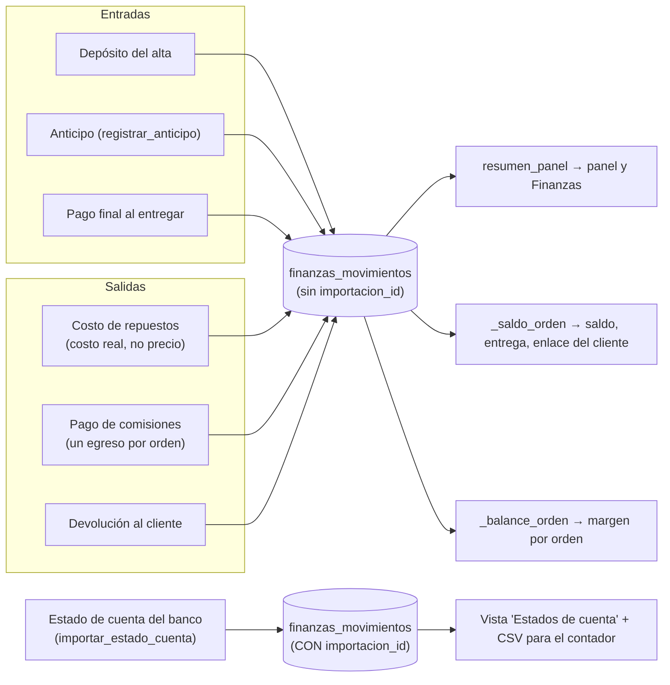

### Comisiones

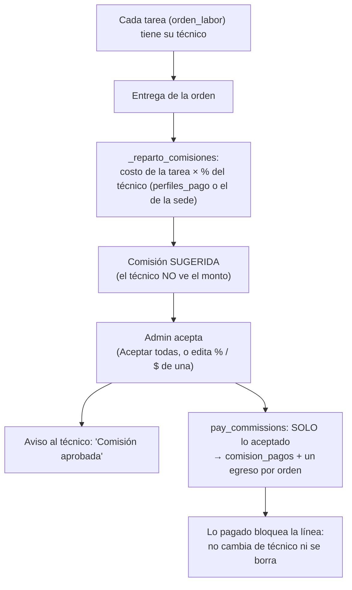

- **Retirada sin reparar**: Modifica qué tareas se cobran/pagan comisión dependiendo del estado.

---

## 8. Seguridad, permisos y roles

### Quién puede hacer qué

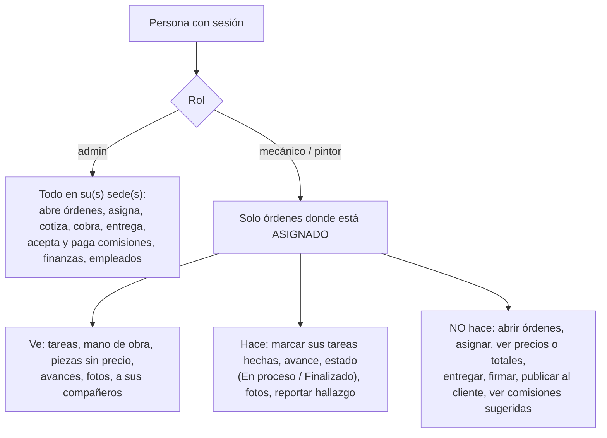

La impone **la base** (RLS y triggers), no la pantalla. Las políticas RLS de Postgres usan funciones `SECURITY DEFINER` para evitar recursiones.
- **Datos de la sede**: `is_admin() OR sede_id = current_user_sede_id()`.
- **Datos de una orden**: un técnico ve **solo sus órdenes asignadas**. Una orden ajena le devuelve cero filas, no error 42501.

Un borrado que RLS rechaza no da error directo; por eso PostgREST usa `.select('id')` con `assertDeleted()`.

### Storage
- `orden_media`: Privado. Lectura de técnico solo de sus órdenes. Escritura solo asignado de orden sin entregar.
- `comprobantes`, `reportes`: Privado. Solo admin.
- `sede_logos`, `avatares`: Público.

---

## 9. Servidor: edge functions, portal y correos

Las **Edge Functions (Deno)**, **pg_net**, y **pg_cron** manejan el trabajo en segundo plano.

### Lo que ve el cliente (El Portal)

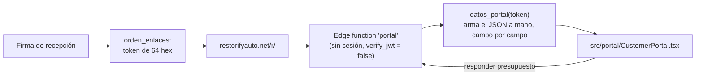

- Todo dato nuevo se agrega a mano en la función `datos_portal` que corre con privilegios elevados, ignorando RLS.

### Avisos, correos y traducciones

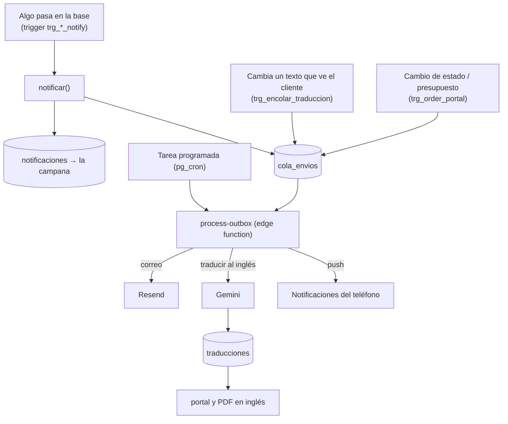

- La cola (`cola_envios`) es el único camino de salida. Trata correos, traducciones y push.

---

## 10. El frontend por dentro

- **Proveedores**: `ErrorBoundary → QueryClientProvider → BrowserRouter → Theme...`. La caché (`QueryClient`) es de quien inició sesión.
- **Datos remotos**: Todo pasa por TanStack Query. Listas completas usan `fetchAll` con paginación explícita (la API corta en 1000 filas por defecto).
- **Manejo de errores**: `lib/errors.ts` traduce errores crudos de Postgres a texto en el idioma del usuario. Jamás se muestra el mensaje crudo.
- **Estilos**: CSS plano (`index.css`, `components.css`). Capas z-index muy controladas (`--z-toast 500`).
- **Móvil**: Tarjetas responsivas, pliegues condicionales, e integraciones PWA (service worker para push, PWA instalable sin caché).
- **Fechas**: Usar `lib/dates.ts` para manejar fechas UTC de medianoche como fechas locales del taller.

---

## 11. Migraciones, flujo de trabajo y cómo sale un cambio

Las migraciones son **la única forma** de cambiar el esquema.

```bash
npm run db:check                          # qué falta aplicar en el proyecto enlazado
npm run db:donde -- sync_order_commissions  # en qué migración está la versión vigente
npx supabase db push --dry-run            # simulacro
npx supabase db push --linked             # aplicar
```

### Cómo sale un cambio a producción

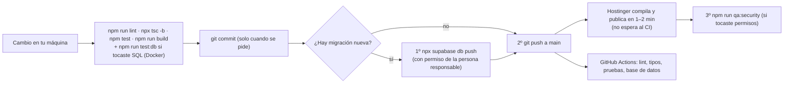

- La base va **antes** que el sitio web, sino la app nueva rompe contra la base vieja.
- Las migraciones nuevas se nombran cronológicamente después de la última conocida.

---

## 12. Levantar el proyecto

```bash
npm install          # el postinstall copia el worker de pdfjs a public/
npm run dev          # http://localhost:5173
```

`.env.local` requiere:
```
VITE_SUPABASE_URL=https://<proyecto>.supabase.co
VITE_SUPABASE_ANON_KEY=<clave anónima>
VITE_PUBLIC_SITE_URL=https://restorifyauto.net
```
*Opcionales*: VAPID para push, Sentry DSN. (Estas variables se incrustan en Vite en tiempo de build).

---

## 13. Solución de problemas y trampas conocidas

| Síntoma | Mira primero |
|---|---|
| Un número de dinero está mal | La función SQL que lo calcula (`npm run db:donde -- <nombre>`), no la pantalla. |
| "Algo salió mal" tras publicar | Archivos viejos atrapados (`lib/staleChunk.ts`); recargar limpia esto. |
| Una pantalla muestra clave `x.algo` | Falta la traducción en `src/i18n/translations.ts`. |
| Técnico no ve algo / ve de más | Políticas RLS de la tabla en `supabase/migrations/`. |
| Un correo no llegó | `cola_envios` (estado, error); logs de la edge function `process-outbox`. |
| Cliente ve algo raro en su enlace | `datos_portal` y `src/portal/`. |
| Una lista parece cortada en 1000 | ¿Usa `fetchAll`? PostgREST tiene un hard cap por defecto. |
| Fechas corridas un día | ¿Usa `hoy_taller()` / `lib/dates.ts`? Nunca uses `toISOString()`. |
| Un cambio no aparece en pantalla | `ORDER_TABLES` y la configuración de Realtime de esa tabla. |

### Otras trampas comunes
- **El cuerpo de funciones plpgsql no se valida al crear.** Una migración errónea pasa y luego crashea en uso real.
- **Un `DELETE` o `UPDATE` sin RLS informa éxito.** Cero filas afectadas no tira error por defecto; usar `.select('id')` con asserts.
- **`supabase storage rm -r` borra todo el bucket.** Para vaciar un bucket usar panel.
- **Dos peticiones HTTP en JS no son transaccionales.** Si algo debe ir atómico, crear una RPC.

---

*Última revisión: (Actualizado recientemente con la fusión de planos y arquitectura. Fases 1–6.)*
