# Los planos de Restorify

Esto es lo más parecido a los planos de una casa: **qué piezas hay, cómo se conectan y dónde
buscar para cambiar cada cosa**. Los diagramas están escritos en Mermaid: GitHub y VS Code
(con la extensión "Markdown Preview Mermaid Support") los dibujan solos.

Cómo usarlo: busca en el **índice** lo que quieres cambiar, ve al diagrama de esa parte y de
ahí al archivo indicado. Para el detalle de reglas, [reglas-de-negocio.md](reglas-de-negocio.md);
para el detalle de archivos por sección, [mapa-de-secciones.md](mapa-de-secciones.md); para lo
que **no se puede romper**, [ai-context.md](ai-context.md).

| Quiero cambiar… | Diagrama | Dónde empezar |
|---|---|---|
| Una pantalla o su texto | [1](#1-las-capas-de-la-casa) y [2](#2-el-mapa-de-pantallas) | `src/pages/`, `src/features/`, `src/i18n/translations.ts` |
| Una regla de dinero o de permisos | [1](#1-las-capas-de-la-casa) y [6](#6-el-camino-del-dinero) | `supabase/migrations/` (siempre una migración nueva) |
| Qué pasa al abrir, trabajar o entregar una orden | [3](#3-el-ciclo-de-vida-de-una-orden) | `useWorkOrderDetail.ts`, `entregar_orden` |
| Comisiones | [7](#7-comisiones) | `_reparto_comisiones`, `pages/Payroll.tsx` |
| Lo que ve el cliente | [8](#8-lo-que-ve-el-cliente) | `datos_portal`, `src/portal/` |
| Correos, avisos, traducciones | [9](#9-avisos-correos-y-traducciones) | `process-outbox`, `notificar()` |
| Quién puede hacer qué | [10](#10-quién-puede-hacer-qué) | políticas RLS y triggers `trg_*_guard` |
| Una tabla | [4](#4-las-tablas-y-cómo-se-relacionan) | `npm run db:donde -- <nombre>` |
| Publicar un cambio | [11](#11-cómo-sale-un-cambio) | [deployment.md](deployment.md) |

---

## 1. Las capas de la casa

La idea que explica todo: **no hay servidor propio**. El navegador habla directo con Supabase,
así que **la seguridad y el dinero viven en la base de datos**, no en la pantalla. Esconder un
botón no es un permiso.

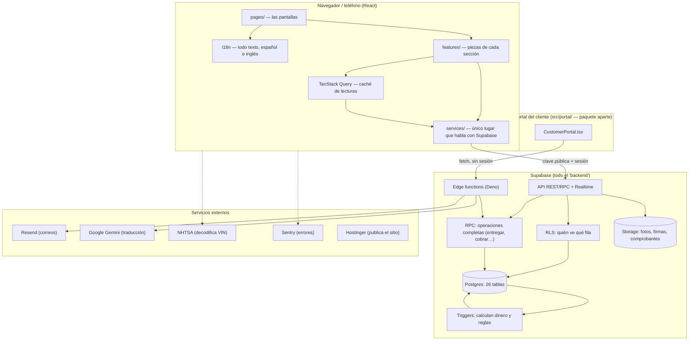

**Reglas de oro que salen de este plano**

- Una **lista** se lee con `fetchAll` (la API corta en 1.000 filas sin avisar); un **total de
  dinero** se pide a una RPC, nunca se suma en el navegador.
- Un cambio de **esquema o permisos** es una migración nueva en `supabase/migrations/`; nunca se
  edita una ya aplicada ni se cambia desde el panel de Supabase.
- Toda función SQL nueva se **revoca** a `PUBLIC, anon, authenticated` y se concede solo a quien
  la necesita.

---

## 2. El mapa de pantallas

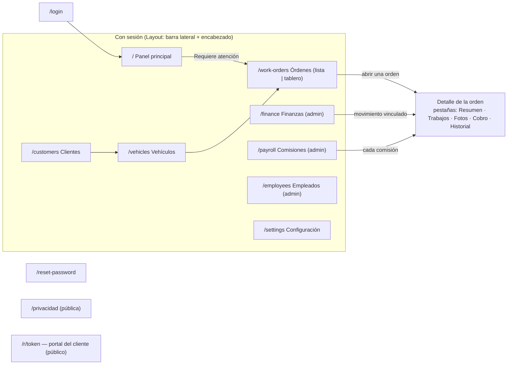

| Pantalla | Archivo | Servicio que usa |
|---|---|---|
| Panel | `pages/Dashboard.tsx`, `features/dashboard/` | `dashboard.service.ts` (`resumen_panel`, `requiere_atencion`) |
| Clientes / Vehículos | `pages/Customers.tsx`, `pages/Vehicles.tsx` | `customers.service.ts`, `vehicles.service.ts` |
| Órdenes (lista y tablero) | `pages/WorkOrders.tsx`, `pages/KanbanBoard.tsx` | `workOrders.service.ts` |
| Detalle de una orden | `features/workOrders/WorkOrderDetail.tsx` + `useWorkOrderDetail.ts` | `workOrders.service.ts`, `quotes.service.ts`, `commissions.service.ts` |
| Alta de una orden | `features/workOrders/WorkOrderCreateModal.tsx` (4 pasos) | `workOrders.service.ts` → RPC `create_work_order` |
| Finanzas | `pages/Finance.tsx`, `pages/finance/ImportStatementModal.tsx` | `finance.service.ts` |
| Comisiones | `pages/Payroll.tsx` | `commissions.service.ts` |
| Empleados | `pages/Employees.tsx`, `features/employees/` | `employees.service.ts`, `users.service.ts` |

---

## 3. El ciclo de vida de una orden

El corazón del programa. Cada flecha dice **quién** la mueve y **qué hace la base** solita.

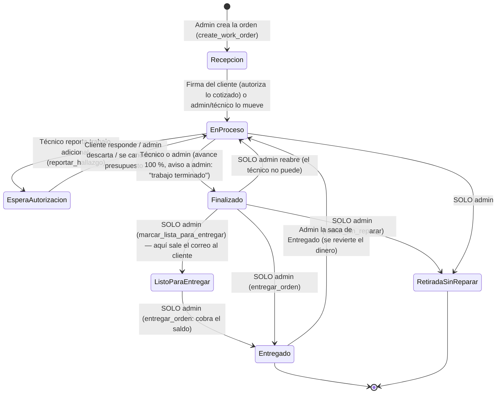

Qué dispara cada paso (todo en la base, `supabase/migrations/`):

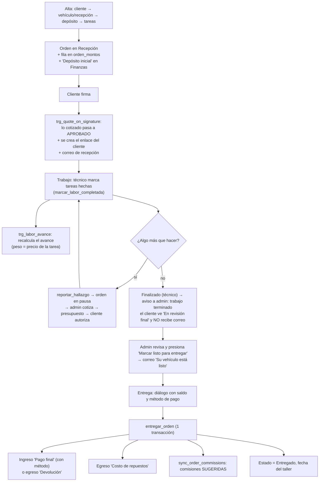

**Dónde tocar:** el flujo de pantalla está en `features/workOrders/useWorkOrderDetail.ts`; el
cobro, en la función SQL `entregar_orden` (`npm run db:donde -- entregar_orden`).

---

## 4. Las tablas y cómo se relacionan

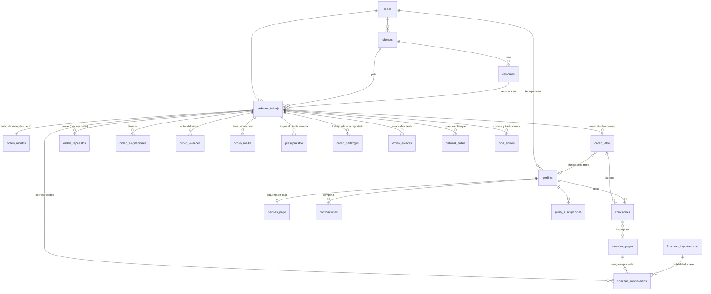

Otras tablas: `finanzas_reglas_categorizacion` (palabras clave de la importación bancaria),
`traducciones` (diccionario es↔en), `numero_orden_contadores` (el `ORD-AAAA-###`).

**Tres cosas que sorprenden:**

- El dinero está **separado**: `orden_montos` y `orden_repuestos` solo los lee un admin. El
  técnico asignado ve la mano de obra (de ahí sale su comisión) y las piezas **sin precio**.
- Solo lo **autorizado** cuenta: `orden_labor` y `orden_repuestos` tienen `estado`
  (`borrador | pendiente | aprobado | rechazado`) y los totales suman solo `aprobado`.
- Lo importado del banco (`importacion_id`) **no** cuenta en nada de la app.

---

## 5. Cómo viaja un dato (de pantalla a base y de vuelta)

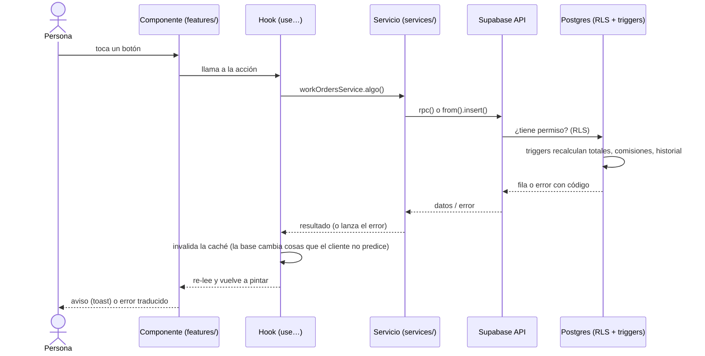

- Los errores se guardan **crudos** y se traducen al pintar (`lib/errors.ts`).
- Un `UPDATE`/`DELETE` que la RLS rechaza **no da error**, devuelve cero filas: por eso los
  servicios piden `.select('id')` y usan `assertAffected` / `assertDeleted`.
- Lo que cambia en otra pantalla se entera por **Realtime** (`useOrderSync`): el evento es una
  señal, se vuelve a leer el dato.

---

## 6. El camino del dinero

Lo único que **nadie escribe a mano**: lo asientan triggers y RPC, siempre con signo e
idempotentes (comparan "lo que debería haber" con "lo que ya hay" y registran la diferencia).

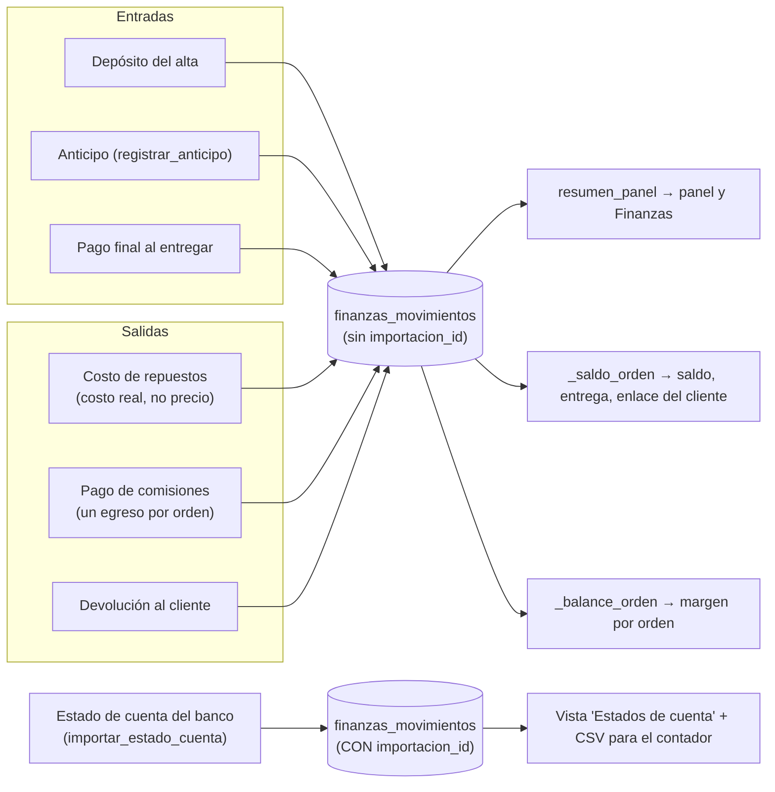

Cuentas que hace la base (no las repitas en el navegador):

```
total de la orden  = mano de obra aprobada + repuestos aprobados − descuento
saldo              = total − (depósito + anticipos + pagos − devoluciones)
margen de la orden = cobrado − costo de repuestos − comisiones devengadas
fecha de un asiento automático = hoy_taller(sede)   ← hora de Maryland, no UTC
```

Descuento: lo absorbe el taller, **no baja las comisiones** (salen de la mano de obra).

**Retirada sin reparar** (`retirar_sin_reparar`):

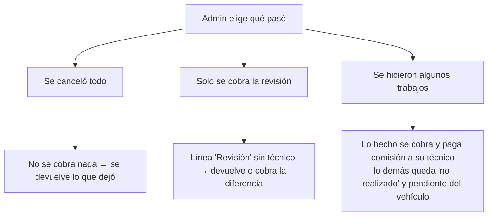

---

## 7. Comisiones

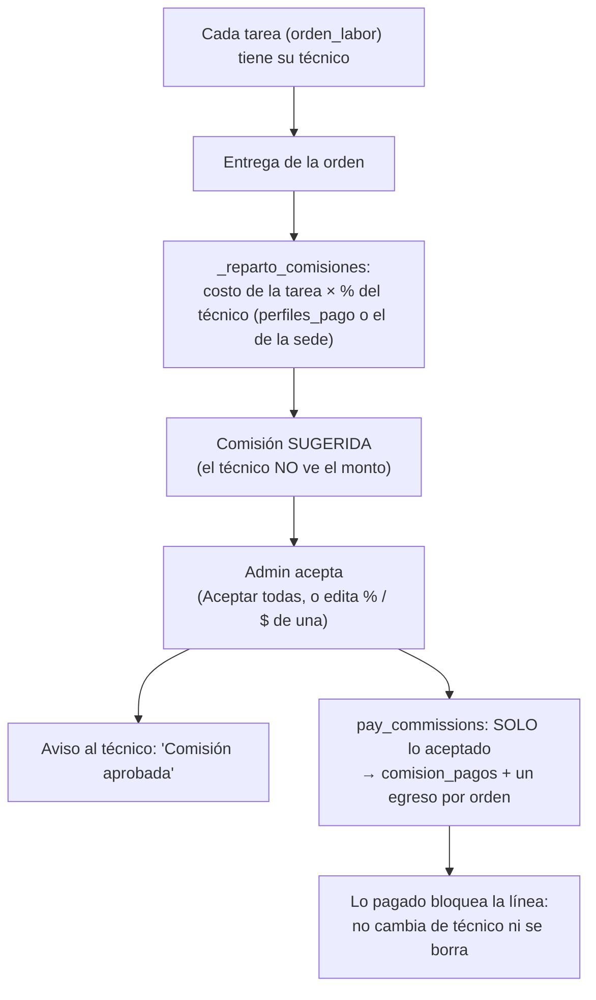

- Líneas anteriores a octubre de 2026 sin técnico: reparto por especialidad
  (`reparto_heredado`), solo entre los asignados a mano.
- Sacar la orden de Entregado borra lo **no pagado**; lo pagado se conserva.
- Detalle: [comisiones.md](comisiones.md). Pantalla: `pages/Payroll.tsx` y la tarjeta
  `features/workOrders/CommissionEstimateCard.tsx`.

---

## 8. Lo que ve el cliente

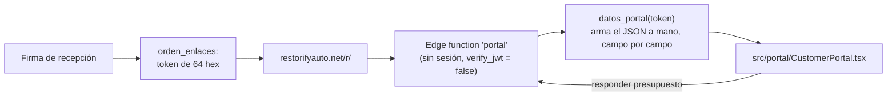

- **Ve:** estado y avance, fotos/videos publicados, avances que el técnico marcó visibles,
  presupuesto línea por línea, su cuenta (depósito, otros pagos, descuento, saldo o saldo a su
  favor), piezas que se esperan, observaciones del taller.
- **No ve:** nombres de técnicos, comisiones, costos, notas internas, VIN completo.
- Todo dato nuevo para el cliente se agrega **a mano** en `datos_portal` (nunca `to_jsonb(fila)`).
- El portal es un **paquete aparte**: no importa `lib/supabase`, `services/` ni
  `i18n/translations.ts`; tiene sus textos en `portal/strings.ts`.

---

## 9. Avisos, correos y traducciones

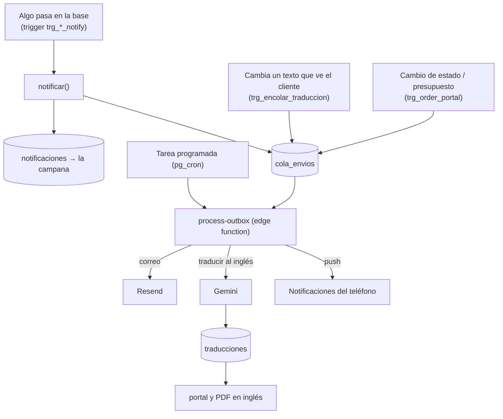

- Un trigger auxiliar **nunca bloquea** una escritura: va en `BEGIN … EXCEPTION → WARNING`.
- Un correo que falla queda en `cola_envios` con su error; administración lo reintenta.
- Detalle: [portal-y-correos.md](portal-y-correos.md), [multimedia-y-notificaciones.md](multimedia-y-notificaciones.md).

---

## 10. Quién puede hacer qué

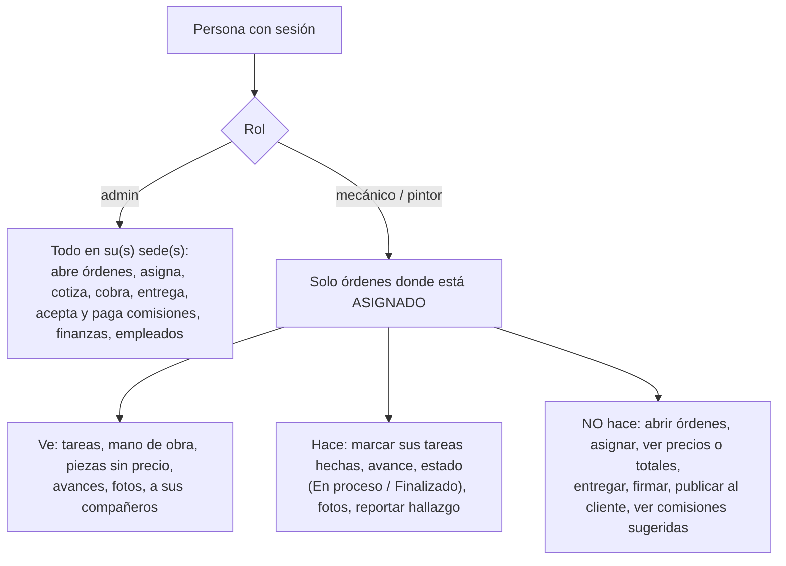

La impone **la base** (RLS y triggers), no la pantalla: `mis_ordenes_asignadas()`,
`is_admin()`, `trg_order_technician_guard`. Tabla completa en
[reglas-de-negocio.md §3](reglas-de-negocio.md#3-qué-puede-hacer-cada-rol).

---

## 11. Cómo sale un cambio

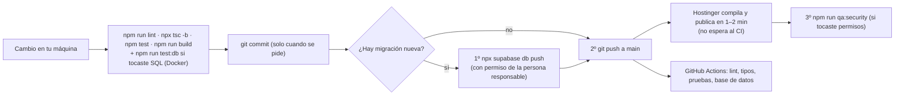

- La base va **antes** que el sitio: una app nueva sobre una base vieja rompe funciones.
- Las migraciones se nombran **después de la última** (`20261010000018` hoy), no con la fecha
  de hoy.
- Si el CI falla con "job was not acquired by Runner", es un incidente de GitHub: se relanza
  con *Re-run all jobs*.

---

## 12. Dónde buscar cuando algo no funciona

| Síntoma | Mira primero |
|---|---|
| Un número de dinero está mal | La función SQL que lo calcula (`npm run db:donde -- <nombre>`), no la pantalla |
| "Algo salió mal" tras publicar | `lib/staleChunk.ts` (pestaña con archivos viejos); recarga |
| Una pantalla muestra una clave como `workOrders.algo` | Falta la traducción: `src/i18n/translations.ts` (es **y** en) |
| Un técnico no ve algo / ve de más | Políticas RLS de esa tabla en `supabase/migrations/` |
| Un correo no llegó | `cola_envios` (estado y último error); `process-outbox`; llave de Resend |
| El cliente ve algo raro en su enlace | `datos_portal` y `src/portal/` |
| Una lista parece cortada | ¿Usa `fetchAll`? La API corta en 1.000 filas |
| Fechas corridas un día | ¿Usa `hoy_taller()` / `lib/dates.ts`? Nunca `CURRENT_DATE` ni `toISOString()` |
| Un cambio no aparece en la otra pantalla | `ORDER_TABLES` y la publicación de Realtime |

---

*Última revisión: 5 de octubre de 2026 (migraciones hasta `20261010000018`). Si cambias la
estructura —una tabla, un estado, una pantalla, un flujo de dinero— actualiza el diagrama
correspondiente en el mismo cambio.*
