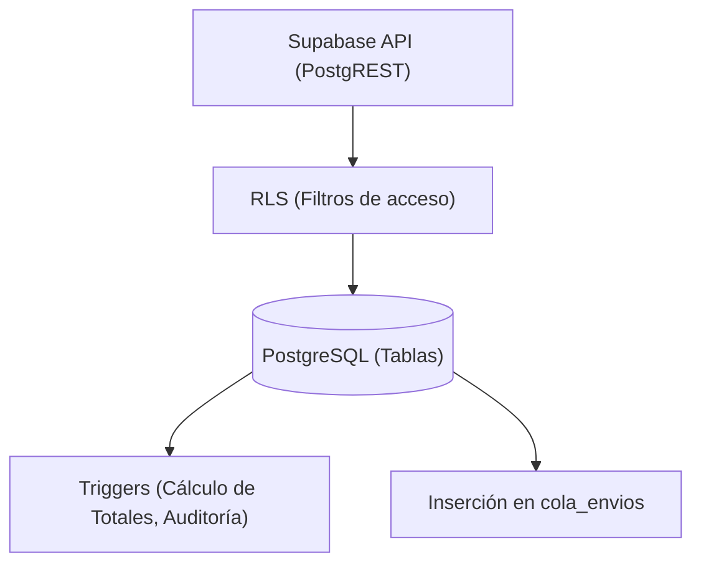
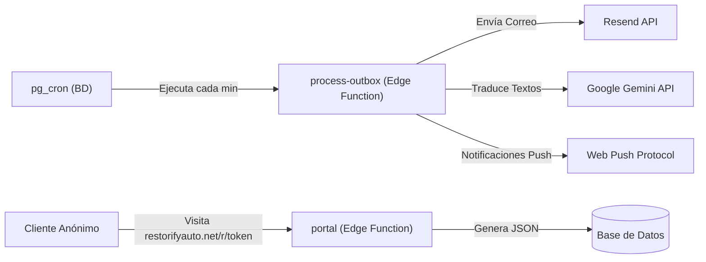

# Radiografía Técnica de Restorify

**Fecha de actualización:** 6 de octubre de 2026
**Audiencia:** Desarrolladores y agentes de IA que toman el proyecto.

Restorify es un sistema B2B multi-sede para talleres mecánicos y de pintura. Administra la operación completa: vehículos, recepción con fotos/videos, presupuestos línea por línea, trabajos, finanzas y cálculo de comisiones.

La característica fundamental del sistema es que **no tiene backend propio**. El navegador del cliente habla directamente con Supabase (PostgreSQL + Auth + Storage) mediante la clave pública anónima. Toda la seguridad, reglas de negocio y cálculos de dinero viven en la base de datos a través de Row Level Security (RLS), triggers y funciones RPC.

---

## 1. Cifras Actuales del Proyecto

| Métrica | Valor | Detalle |
| :--- | :--- | :--- |
| **Archivos fuente (TypeScript)** | 187 | `src/` excluyendo pruebas |
| **Pruebas (Vitest)** | 90 archivos | 737 tests unitarios y de componentes |
| **Migraciones de base de datos** | 76 | En `supabase/migrations/` |
| **Tablas de base de datos** | ~26 | El esquema principal está en `public` |
| **Pruebas de base de datos** | 29 | `supabase/tests/database/` (pgTAP) |
| **Edge Functions** | 6 | En `supabase/functions/` (Deno 2) |
| **Pruebas e2e** | 9 | En `e2e/` (Playwright) |

---

## 2. Estructura del Repositorio

El proyecto utiliza **Vite 8**, **React 19**, **TypeScript 6**, y no utiliza ningún framework de UI complejo (ni Tailwind ni Material UI), empleando **CSS plano** con variables.

```text
restorify/
├── src/                      # Código fuente de React
│   ├── components/           # Componentes UI reutilizables (Botones, Modales, Inputs)
│   ├── context/              # Estado global (Auth, Toast, Idioma, Tema)
│   ├── features/             # Lógica de dominio particionada (órdenes, empleados, finanzas)
│   ├── i18n/                 # Diccionarios de traducción (translations.ts)
│   ├── lib/                  # Utilidades sin React (matemáticas, fechas, formateo)
│   ├── pages/                # Vistas principales (enrutadas vía React Router)
│   ├── portal/               # Paquete independiente: el portal del cliente sin sesión
│   ├── services/             # Capa de datos: TODO el acceso a Supabase pasa por aquí
│   ├── styles/               # CSS global (index.css, components.css)
│   └── types/                # Tipos TypeScript, incluyendo `database.ts` autogenerado
├── supabase/                 # El backend "Infrastructure as Code"
│   ├── functions/            # Edge Functions (Deno)
│   ├── migrations/           # Definición de tablas, RLS, triggers y RPCs en SQL
│   └── tests/                # Pruebas pgTAP para lógica en BD
├── public/                   # Service workers, iconos PWA y .htaccess
├── e2e/                      # Pruebas End-to-End (Playwright)
├── scripts/                  # Utilidades de mantenimiento (QA, migraciones, scripts en JS/Bash)
└── docs/                     # Documentación del proyecto (tú estás aquí)
```

### Reglas Estructurales Críticas
1. **Nada llama a Supabase directo desde un componente.** Todo pasa por `services/`.
2. **Las listas crecen indefinidamente.** Usa siempre `.fetchAll()` o paginación. La API nativa de Supabase corta a 1000 registros sin avisar.
3. **El estado de la UI es secundario.** La base de datos es la única fuente de verdad; TanStack Query maneja la caché. Ante la duda, invalida caché y recarga.

---

## 3. Módulos y Dominio

El sistema se divide en varios dominios funcionales, reflejados en `src/features/` y `src/services/`.

### 3.1 Órdenes de Trabajo (`workOrders`)
El núcleo del sistema. Administra el ciclo de vida del vehículo en el taller.
- **Creación:** Asistente de 4 pasos (Cliente, Vehículo, Recepción con fotos 360°, Tareas y Depósito). Usa `create_work_order` (RPC transaccional).
- **Ejecución:** Los técnicos marcan sus tareas. `trg_labor_avance` recalcula el porcentaje de avance general.
- **Presupuestos:** Se envían cotizaciones por correo/SMS. El cliente aprueba/rechaza cada línea (repuesto/tarea) desde el portal.
- **Entrega:** La orden se marca como "Lista". El admin la entrega vía `entregar_orden`, que bloquea modificaciones futuras y asienta el ingreso del saldo en finanzas.
- **Archivado:** Una vez entregada, la orden desaparece de la vista principal si tiene más de 90 días, o puede ser ocultada manualmente por el administrador (esto graba la fecha en la columna `archivada_en`, la cual exige por regla de BD que la orden esté previamente `entregado`).

### 3.2 Finanzas (`finance`)
- **Contabilidad Automática:** Los cobros de entrega, depósitos, pagos de comisiones y costos de repuestos son insertados automáticamente por triggers.
- **Conciliación:** Los estados de cuenta bancarios se importan (`importar_estado_cuenta`) y se emparejan, para separar lo contable de lo operativo.

### 3.3 Empleados y Comisiones (`employees` / `payroll`)
- Un técnico tiene asignadas tareas específicas dentro de una orden.
- Al entregarse la orden, `_reparto_comisiones` calcula lo que se debe pagar.
- Las comisiones nacen como "Sugeridas". Un admin debe aceptarlas explícitamente (`aprobar_comision`) antes de pagarlas (`pay_commissions`).

### 3.4 Multimedia (`media`)
- Captura fotos, video (hasta 2 min) y notas de voz nativamente en la web.
- Sube a Storage usando TUS (cargas reanudables) a través del bucket `orden_media`.

---

## 4. Arquitectura de Base de Datos y Seguridad

### 4.1 Row Level Security (RLS)
La base de datos (PostgreSQL 17) filtra lo que el usuario puede ver y hacer:
- **Administradores:** Ven toda su sede.
- **Técnicos (Mecánicos/Pintores):** Ven **exclusivamente** las órdenes a las que están explícitamente asignados (`is_assigned_to_order`).
- **Secretos:** Tablas como `orden_montos` (dinero) o `finanzas_movimientos` tienen políticas estrictas; los técnicos no pueden leerlas. Para que un técnico vea una lista de repuestos sin precios, se usa una vista/RPC `SECURITY DEFINER` llamada `repuestos_de_orden`.

### 4.2 Lógica en Triggers y RPCs
Dado que no hay backend intermedio, PostgreSQL actúa como orquestador:
- **Dinero siempre en Triggers:** Nadie puede mandar `total_general = 100` desde la API. Si se agrega un repuesto de $50, el trigger recalcula el total de la orden.
- **Notificaciones (Event Sourcing):** Un trigger (`trg_*_notify`) detecta un evento (ej. "orden lista") e inserta un registro en `cola_envios`.



---

## 5. Edge Functions y Servicios Externos

El trabajo en segundo plano, integraciones de terceros y accesos anónimos controlados suceden en Supabase Edge Functions (Deno).



### Funciones Principales
1. **`process-outbox`:** Lee `cola_envios` y despacha correos (Resend), notificaciones push, y traducciones al inglés (Gemini).
2. **`portal`:** El portal del cliente, que no usa la librería de Supabase, hace peticiones HTTP a esta función, la cual lee de la base de datos de forma segura (usando tokens de enlace) para servir la cotización.
3. **`cleanup-storage`:** Tarea de limpieza programada para purgar huérfanos.

### Integraciones Externas
- **Resend:** Proveedor de emails transaccionales.
- **Google Gemini:** Traducción automática de la bitácora del técnico al inglés para clientes que prefieren ese idioma (recientemente migrado para omitir `temperature` y cumplir con la API v3.8 Flash).
- **NHTSA:** API pública del gobierno de EE. UU. usada en el frontend para decodificar VINs (Vehicle Identification Numbers).

---

## 6. Proceso de Despliegue

Hostinger publica la aplicación web de manera estática a partir del repositorio de GitHub. 
Supabase se gestiona vía CLI.

1. **Base de Datos Primero:** Las migraciones SQL deben aplicarse antes de desplegar el código frontend (`npx supabase db push`).
2. **Validación:** El código debe pasar `oxlint`, `tsc -b`, `vitest` y `qa:security` (script que asegura que no haya funciones RPC públicas sin RLS).
3. **Despliegue Frontend:** Un push a la rama principal detona el build en Hostinger.
